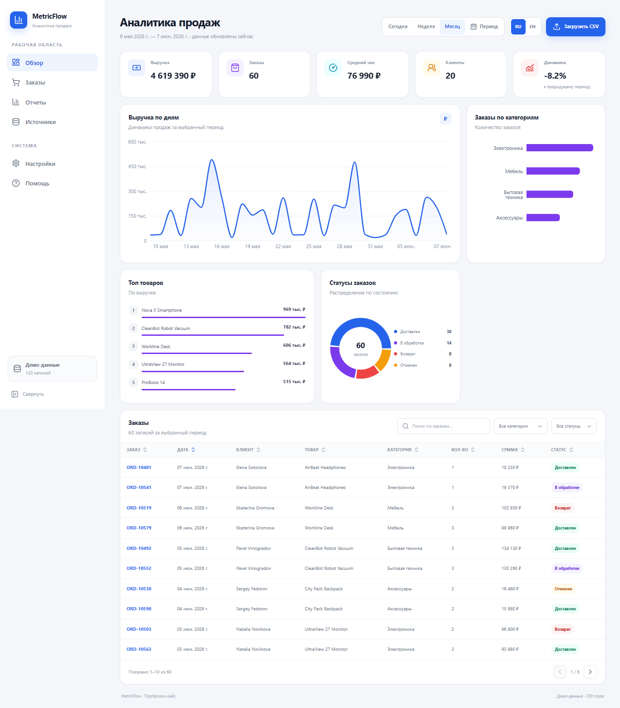

# Sales Analytics Dashboard


Sales Analytics Dashboard is a bilingual frontend case study for sales-data ingestion and analysis. It starts with deterministic demo orders and lets users explore KPIs, date ranges, charts, filters, a paginated table, or replace the in-memory dataset with a validated CSV file.

## Live Demo

https://sales-analytics-dashboard-blush-sigma.vercel.app

## Source Code

https://github.com/Andrey15211/sales-analytics-dashboard

## Features

- Revenue, orders, average order value, and customer KPIs
- Previous-period revenue comparison
- Today, week, month, and custom date ranges
- Revenue, category, product, and status visualizations
- Sortable and paginated order table
- Search plus category and status filters
- CSV upload, normalization, validation, and localized errors
- Responsive loading, error, and empty states

## Tech Stack

- React 18
- Vite 6
- TypeScript
- Tailwind CSS
- Recharts
- TanStack Table
- PapaParse
- Vitest

## Localization

- RU/EN support: controls, KPIs, charts, tables, filters, dates, numbers, and errors
- Default language: Russian
- Language switcher: available in the dashboard header
- Locale preference: persisted in `localStorage`
- CSV statuses may be supplied in Russian or English

## Screenshots

### Desktop



### Mobile

Planned path: `docs/screenshots/mobile.png`

### RU/EN example

Planned path: `docs/screenshots/localization.png`

Mobile and localization screenshots will be added after final interactive capture.

## Local Development

```bash
npm install
npm run dev
npm run build
```

Vite normally serves the app at `http://localhost:5173`.

## Deployment

Deployed on Vercel with the Vite preset, `npm run build`, and `dist` as the output directory. No environment variables or backend are required.

## What this project demonstrates

- Dashboard and data visualization
- CSV ingestion and validation
- KPI and grouped aggregation logic
- Data-table workflows
- Typed localized frontend architecture

## Recommended GitHub Topics

`sales-dashboard` `analytics-dashboard` `data-visualization` `react` `vite` `typescript` `recharts` `tanstack-table` `papaparse` `vercel`
